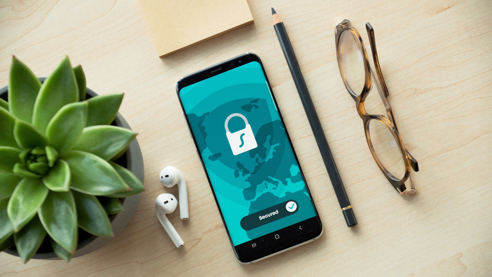
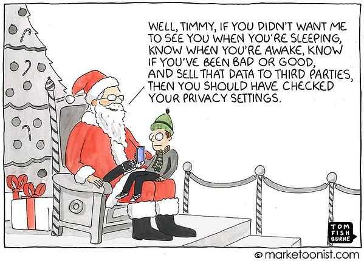
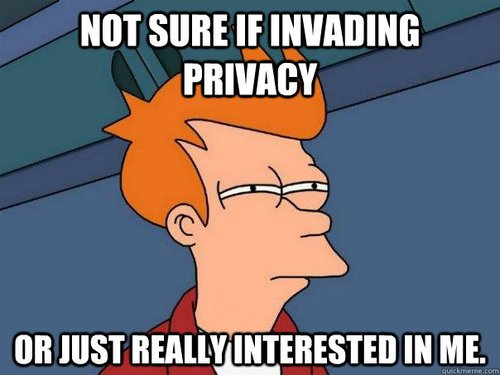
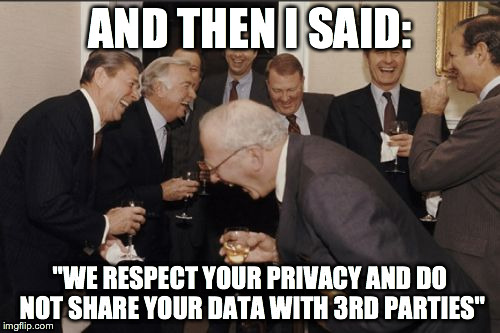
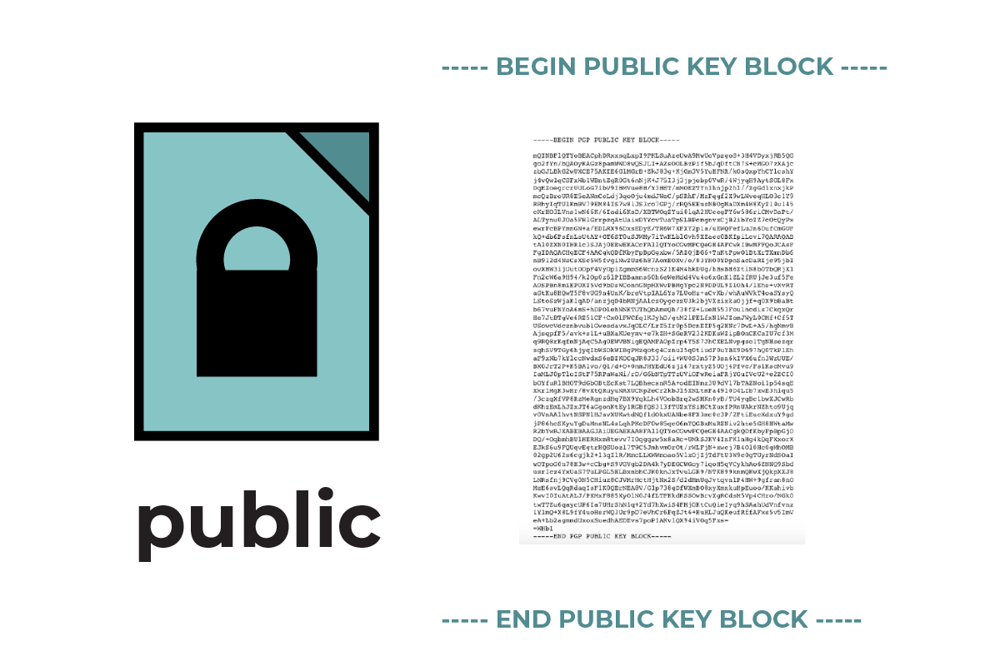
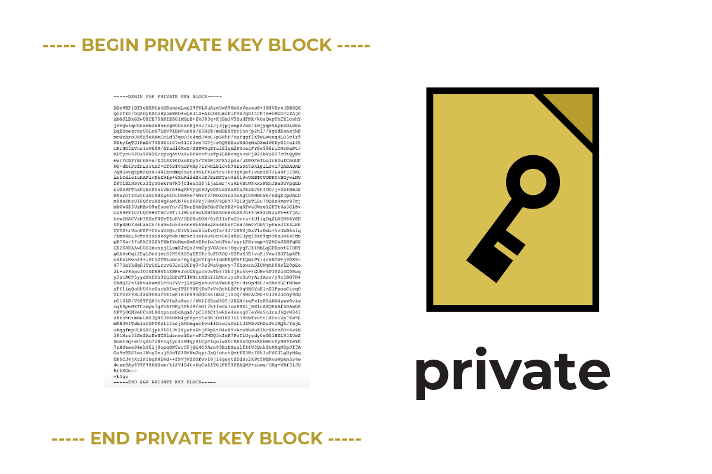

What, Why, and How to Privacy?

# Embracing Privacy

Taking back your privacy…

## Motivation

With the rise of privacy and security concerns, it suddenly struck me that, **Should I care about my Privacy?** 

I thought to myself, I am not a big celebrity, I am not doing anything wrong or illegal, neither am I working on something so sensitive that anyone getting a hold of it will bring an end to the world. Basically, I have nothing to hide and I am so comfortable using products by Google, Microsoft and other companies which provide such a curated list of highly fine tuned and finished products to us that why should I even bother about my privacy?

And most of these companies,  don’t actually sell your data to any 3^rd^ party, instead, they basically use it for internal purposes and to further improve my experience. Then why should I bother?

Even if some companies do sell my data to other 3^rd^ party vendors, do I have anything to lose if my personal data is being compromised?

At the max, I just have to be cautious enough not to store sensitive information like bank details and passwords in any cloud based synchronization service. Doing that itself should be enough for me to safeguard myself from harm. This is enough, right?

> **“Arguing that you don't care about the right to privacy because you have nothing to hide is no different than saying you don't care about free speech because you have nothing to say.”**
> — Edward Joseph Snowden

**Well………No……..**

Let me tell you what my concerns as a common man:

- **My data is being used to study me and provide Ads**.

  Again, why is this an issue? Well, on a very broad level, I feel like I am manipulated by these giant companies. I feel like my thoughts are controlled by these people who have no other agenda other than making money. Why should I let myself into getting manipulated for other people’s benefits? 

  For eg: Suddenly, if I have a thought of buying some item, let's say a washing machine, I would search for it on Amazon and Flipkart and very soon, I will be bombarded with dozens of advertisements about washing machines all over the place. 
  What’s the Issue? Well for starters, I would be constantly reminded that I need to purchase that item, even if I might not need it later on. The time that I need to make the right judgement whether I really need the item or not is no longer given to me. I would be so overwhelmed by the advertisements that I will no longer be able to concentrate on other things apart from this.

  Secondly, this constant reminder would not only decrease my productivity, but also shape me into a being who is more prone to sudden visual cues, and can be easily manipulated that way. 

  This might seem to be a very small example and you might think that you can easily handle your thought process and not fall into this trap, but imagine, when it comes to bigger decisions, like casting a vote, and you are constantly reminded of only 1 candidate, this could cloud your decision. Such small things can greatly impact our lifestyle and our future.

- **My lifestyle is being manipulated by these services**

  You might argue, that your lifestyle has become better with Google Assistant or Siri or Bixby and that you have become habituated to these services. Well guess what, if this is your case, then **these companies have already won half of the battle**. These companies have now made sure that you can’t live without their services and can easily manipulate you with their choices. 

  For eg: When Apple removed the headphone-jack, people who were so used to using iPhones couldn’t do a thing and had to live with the decision of a "no headphone jack" phone. Such things greatly impact our day to day life but we have become so easy going and pushovers when it comes to technology that we adjust with what the industry has to offer, and we can't let go of or revolt against their choices.

  A last one: We all use Windows, don't we? Windows 10 to be precise….Do you remember that we were actually forced to migrate from windows 7, 8 ,8.1, XP to windows 10. You might argue that windows 10 looks prettier, has better customizations and is the latest compared to the other versions of Operating Systems. Well you are right, but with these new features, also come the **forceful hour-long updates**, collection of user data for “internal use”, downloading of updates on metered connections and basically being taken out of your comfort zone and being forced to learn to use a different Software. So basically, you spent a hefty amount on purchasing a good hardware only to be controlled by the software for using it. Don’t you think this is a wrong thing to do? What if, in future, Windows starts charging its users a monthly subscription? Will you be able to shift to an alternative? Do you have any alternative in mind? Or are you going to pay the monthly ransom(I mean the subscription amount).

- **Impacted my zeal for Innovation**

  Nowadays people have been so limited by these services that they have lost (you had written 'not lost', check once) the way to think outside these services. People have taken the features provided by these services for granted so much that anything which these services can't provide is deemed unachievable by the masses. 

- **Impacted my perspective**

  We have started consuming these services to such an extent that they now control our perspective. People have been so used to social media and other services that whatever these services broadcast is being accepted without any auditing of the information provided.  And such have been the times that these services can easily change the mindset of the people by providing curated contents which satisfy their interests.

## Our Daily Life

To give you an in depth perspective, let me list some products which we use that totally violate our right to privacy….

<table style="undefined;table-layout: fixed; width: 1272px">
<colgroup>
<col style="width: 478px">
<col style="width: 794px">
</colgroup>
<thead>
  <tr>
    <th>Companies</th>
    <th>Products</th>
  </tr>
</thead>
<tbody>
  <tr>
    <td rowspan="6">Facebook</td>
    <td>Whatsapp</td>
  </tr>
  <tr>
    <td>Facebook</td>
  </tr>
  <tr>
    <td>Instagram</td>
  </tr>
  <tr>
    <td>Boomerang App</td>
  </tr>
  <tr>
    <td>Moments App</td>
  </tr>
  <tr>
    <td>Oculus</td>
  </tr>
  <tr>
    <td rowspan="19">Google</td>
    <td>Google Search</td>
  </tr>
  <tr>
    <td>Keep Notes</td>
  </tr>
  <tr>
    <td>Gmail</td>
  </tr>
  <tr>
    <td>Calendar</td>
  </tr>
  <tr>
    <td>Docs</td>
  </tr>
  <tr>
    <td>Google Drive</td>
  </tr>
  <tr>
    <td>Play Store</td>
  </tr>
  <tr>
    <td>Play Music</td>
  </tr>
  <tr>
    <td>Youtube</td>
  </tr>
  <tr>
    <td>Duo</td>
  </tr>
  <tr>
    <td>Assistant</td>
  </tr>
  <tr>
    <td>Chrome</td>
  </tr>
  <tr>
    <td>Pixel</td>
  </tr>
  <tr>
    <td>Contacts</td>
  </tr>
  <tr>
    <td>Feeds</td>
  </tr>
  <tr>
    <td>Google Fit</td>
  </tr>
  <tr>
    <td>Google Flights</td>
  </tr>
  <tr>
    <td>Google Photos</td>
  </tr>
  <tr>
    <td>Maps</td>
  </tr>
  <tr>
    <td rowspan="16">Microsoft</td>
    <td>Windows</td>
  </tr>
  <tr>
    <td>Github</td>
  </tr>
  <tr>
    <td>NPM</td>
  </tr>
  <tr>
    <td>Visual Studio</td>
  </tr>
  <tr>
    <td>XBox</td>
  </tr>
  <tr>
    <td>Skype</td>
  </tr>
  <tr>
    <td>Bing</td>
  </tr>
  <tr>
    <td>Azure</td>
  </tr>
  <tr>
    <td>LinkedIn</td>
  </tr>
  <tr>
    <td>Office</td>
  </tr>
  <tr>
    <td>Outlook</td>
  </tr>
  <tr>
    <td>OneDrive</td>
  </tr>
  <tr>
    <td>OneNote</td>
  </tr>
  <tr>
    <td>Cortona</td>
  </tr>
  <tr>
    <td>Edge</td>
  </tr>
  <tr>
    <td>Surface</td>
  </tr>
  <tr>
    <td rowspan="12">Amazon</td>
    <td>Amazon Store</td>
  </tr>
  <tr>
    <td>Alexa</td>
  </tr>
  <tr>
    <td>Prime Videos</td>
  </tr>
  <tr>
    <td>Echo</td>
  </tr>
  <tr>
    <td>Firestick</td>
  </tr>
  <tr>
    <td>Kindle</td>
  </tr>
  <tr>
    <td>AWS</td>
  </tr>
  <tr>
    <td>Audible</td>
  </tr>
  <tr>
    <td>Goodreads</td>
  </tr>
  <tr>
    <td>IMDb</td>
  </tr>
  <tr>
    <td>Junglee</td>
  </tr>
  <tr>
    <td>Twitch</td>
  </tr>
</tbody>
</table>

## Data These companies Have about YOU!!

Take a look at this [site](https://takeout.google.com/) which allows you to ***export your google data***. According to this site, google has the following data about you:

-  Android configuration
   -  Can be used to understand your mobile use patterns 
-  Your cultural and political interest
   - from your news and feed interests
-  Calendar Info
   - Can be used to get sensitive info about you
-  Contacts info
   - Sensitive info about your near and dear
-  Websites you visit through using Google Chrome or Google Search
   - Political, technical and other interests
-  Crisis User report
   - Only Google what this is!! 
-  Data shared for research
   - Apart from all other data, what data is this then???
-  Fitness info
   - Your health conditions and health patterns
-  Photos
   - Sensitive information about you and your friends and relatives
-  Drive
   - Personal sensitive information
-  Keep notes
   -  Santa might know what you need for Christmas!!
-  **Location History**
   - Places you visit and other patterns 
- Maps Info
- News Info
-  Purchases and Reservation
   - Your purchasing pattern for advertisements
- And a lot more

Data stored by ***Microsoft*** in this [site](https://account.microsoft.com/account/privacy?view=browse&ru=https%3A%2F%2Faccount.microsoft.com%2Fprivacy%2Factivity-history%3Fview%3Dbrowse&destrt=privacy-dashboard):

- **Browsing Data**
- **Location Data**
- Cortona Data
- Ad preferences
- Skype data
- Marketing Preferences
- Office data
- Apps and Other Service information

## Alternative Options

Well, now that we know what these companies have about us, we can start taking measures so that more data is not tracked by these services from now on. 

An alternative is to use different services so that *a single* company doesn’t have all the data about you. This is not exactly a privacy adhering alternative but at the very least, you won't be manipulated easily as *a single* service won't have all the necessary information about you to curate the service to manipulate you. This will surely bring down the quality of your experience, but you will now be more self aware.

The next best bet is to use privacy focused solutions. These services are often audited for privacy related concerns and usually provide end-to-end encryption so that even if they have your data, it is secure because it is encrypted. But then, here, a single service will have quite a good amount of data about you and later on, if a loophole emerges, it might put your data in danger. But this is still a better option than the previous one and it is a good practice to use multiple privacy focused solutions so that again, *a single* service will not have a lot of data about you and any loophole emerging will not put you at risk.

The best solution is to use Open Source services and solutions. This is by far the only way to be prepared for any privacy related catastrophe and, there is a 99.99% chance that there is no loophole. Open Source solution means that the source code of the technology is openly available and that, if any loophole is found by people other than the developers, it is fixed as soon as possible. But this too comes with a caveat. The solutions would provide many features that you might require but chances are less that the user experience will be as top notch as compared to the big company solutions that are provided for free. Another downside is that you might be required to put in a little effort to start using and setting it up, but this is only an initial issue and will not bug you as the time passes by.

Another best approach is to use a mix of privacy focused solutions and Open Source solutions. This way, your daily productivity won't be hindered, as closed sourced privacy focused solutions are quite polished and resemble the current privacy concerned solutions and the Open Source solutions are there to cover as much ground as they can.

## Transitioning is *HARD!!*

The biggest issue now is to make the transition.

This is by far the most difficult job. The mentioned giant tech-companies are mainly to be blamed for this. They have provided so many solutions just under the same umbrella that, now shifting to a bunch of new software is messy.

They provide 

- easy sign-in into new services 
- easy management of all services
- free services
- seamless integration with windows, android and iOS devices
- other seamless options which make users feel comfortable

While shifting to privacy focused or Open Source solutions, you will miss these features. The main issue with the alternate services are:

- Good to mediocre user interface
- A little techy setup
- No seamless integration with a variety of services
- Manual setup in different devices based on the operating systems
- A 'little less curated' options 

But don’t let these points stop you because what you would gain from shifting to new alternatives is way beyond you can imagine:

- Way too much customizations
- Unheard and unseen productive features not provided by current apps
- Once set up, then little to no issue for eternity
- Easy integration with other open-source or privacy focused solutions
- No breach of Privacy
- No advertisements
- No irritating notifications about other unnecessary services
- New updates bring a bunch of new features
- With the growing Open Source community, better user interfaces
- Easy to turn off features which you don’t require
- No collection of private information
- Easy removal or switching to other services without impacting any existing solutions

## Why Open Source

If you are worried because of the above concerns that I brought up, don’t worry, we are still not doomed yet. Because we still have some people who did predict this future and have already started working on it. 

Let me introduce you to the Open Source Community.

The best part of this community is that it has all kinds of solutions you may require and it has zero tolerance for breach of privacy. It provides many options for a single type of solution, thus giving users a bunch of alternatives if they are not happy with one. It integrates well with other Open Source solutions, thus helping us to create a proper ecosystem in its place. 

**It brings new features on a daily basis** and is **free to use** most of the times. 

Do note that shifting from existing services to Open Source and other privacy concerned solutions will take some time to get used to. As it took us a long time to integrate these solutions itself into our daily lives, it will similarly take time to shift from privacy breached services to alternative solutions.

## A little knowledge on Encryption/Cryptography

Before we dive into the alternatives of our day to day applications to protect our right to privacy, let's discuss the key component that these applications use, Encryption.

Most of the alternatives I am about to discuss use one or more ways of encryption and this technique is fairly automatic which doesn’t require us to get our hands dirty, but this also doesn’t mean that we should totally take their word as a holy text and follow it.

Knowing encryption is similar to knowing how to operate a fire extinguisher… you might never have to use it but you should know how it operates just in case you require to use it. 

Encryption is also the medium to enhance your security in the digital world apart from aiding you with privacy.

Key components in Encryption are:

- Cipher Keys

- Encryption algorithm

  

An encryption algorithm basically uses a cipher key to scramble your message so that only the recipient who has the cipher key can de-scramble it to extract the message. Anyone else who gets hold of the message but doesn’t have the cipher key will not be able to extract the message.

Usually the length of the cipher key entails the encryption level of the algorithm. Thus, using a very small key will result in a poor encryption and using a lengthy key will result in a very powerful encryption, irrespective of the algorithm used. In our day to day life, a *256 bit* key is far more than enough to get a good encryption which can't be decrypted easily by a 3rd party.

Usually the encryption and decryption algorithms are publicly available and only the keys are private to people exchanging messages.

There are mainly 2 types of encryption algorithms:

- Symmetric, eg:
  - AES
  - DES
  - RC4,5,6
  - Blowfish
- Asymmetric, eg:
  - RSA
  - PGP(actually a hybrid of symmetric and asymmetric, but for understanding purpose we will categorize this under asymmetric)

The main difference between symmetric and asymmetric encryption methods is that, the symmetric encryption algorithm uses one key only, and this same key is used to encrypt and decrypt the messages, whereas in asymmetric algorithm, two keys(Public and Private key) are used, one(Private Key) to encrypt the message and the other(Public Key) to decrypt the message.

HTTPS, the secure version of HTTP which uses certificate system to ensure its authenticity of a website (and also the privacy and integrity of the data transmitted) is a form of asymmetric encryption, where the certificate is encrypted using the private key of the certificate owner and the public key which is publicly available is used to decrypt the certificate to confirm the authenticity of the website.

### Encrypted Mode of communication

In encrypted mode of communication, a pair of two keys are used.

- Key used by Sender
  - Private Key of Sender
  - Public key of Receiver
- Key used by Receiver
  - Public key of Sender
  - Private Key of Receiver

Here, the message is doubly encrypted, first, using the Private key of the Sender(can only be decrypted using the public key of the sender) and then using the Public key of Receiver(can only be decrypted using the private key of the receiver).
The message when received by the receiver is then first decrypted using the Private key of the Receiver and then the Public key of the Sender.

This ensures that the server hosting your emails itself can’t read them as your private key will be required to decrypt them.

Actually, the use of Public Key of the Receiver is enough to encrypt the message so that only the Receiver can decrypt it using its own Private Key. A second layer of encryption using the Sender’s Private Key is used to authenticate that the Sender has himself sent the message and not a 3rd party who is an impostor of the Sender(who would have a different private key). As a result the message can only be decrypted using the Sender’s Public Key and if it can’t decrypt using the Sender’s Public Key, the Receiver will know that someone else has sent the mail by stealing the Sender’s identity (as the public key to decrypt this *harmful* message would be different from the actual sender’s public key).

### Using GnuPGP

GnuPGP is the the Open Source implementation of the PGP (Pretty Good Privacy) algorithm provided by the famous GNU, which is free to use. While using this, you will have to generate a public key and a private key and will have to distribute the public key to places where you want a mode of secure communication. Usually, this is automatically handled, but some applications might require you to provide them with the public key yourself.

**NOTE: Never provide the Private PGP keys to anyone, as it is should only reside on your system and should be used by you alone**

## Securing Web Traffic

- Use VPN

- Use TOR (—- a kind of free and safe alternative to VPN)

- If using Chromium based Web browsers, then use extension

  - [DuckDuckGo extension](https://chrome.google.com/webstore/detail/duckduckgo-privacy-essent/bkdgflcldnnnapblkhphbgpggdiikppg)
  - [CokieAutoDelete](https://chrome.google.com/webstore/detail/cookie-autodelete/fhcgjolkccmbidfldomjliifgaodjagh)
  - [HTTPS everywhere](https://chrome.google.com/webstore/detail/https-everywhere/gcbommkclmclpchllfjekcdonpmejbdp)
  - [UBlock Origin](https://chrome.google.com/webstore/detail/ublock-origin/cjpalhdlnbpafiamejdnhcphjbkeiagm)

- Password Manager

  - [KeePass](https://keepass.info/)

  - [KeePassXC](https://keepassxc.org/)

    — Corresponding Android Application -> [Keepass2Android](https://play.google.com/store/apps/details?id=keepass2android.keepass2android&hl=en_US)

  - [Passbolt](https://www.passbolt.com/)

## Alternatives

**Note: I have not been paid or asked to endorse these solutions, I am just doing this out of good faith in the community and as a long time user of these alternatives. I think they deserve some praise.**

### Search Engine

Used Product

- Google Search **:Google**
- Bing**:Microsoft**

Alternatives

- [DuckDuckGO](https://duckduckgo.com/)
- [Searx](https://www.searx.ch/)

### Social Network

Used Product

- Facebook**:Facebook**
- Instagram**:Facebook**

Alternatives

- [Chttr](https://chttr.co/)
- [ScuttleButt](https://www.sailingscuttlebutt.com/)

### Messenger

Used Product

- Whatsapp**:Facebook**
- Facebook Messenger**:Facebook**

Alternatives

- [Signal](https://www.signal.org/)
- [Telegram](https://telegram.org/)
- [Wire](https://wire.com/en/)

### Cloud Storage

Used Product

- Google Drive**:Google**
- One Drive**:Microsoft**

Alternatives

- [IPFS](https://ipfscloud.store/)

  — A decentralised Cloud storage service

- [Syncthing](https://docs.syncthing.net/intro/getting-started.html) 

  — Offline File syncing 

- [Seafile](https://www.seafile.com/en/home/)

- [SpiderOak ONE](https://www.seafile.com/en/home/)

  — Edward Snowden endorsed

  — Non Free end-to-end encrypted alternative to Google Drive

- [Cozy Cloud](https://cozy.io/en)

- [Mega](https://mega.nz/)

  — Free encrypted basic Google Drive alternative

- [Teseroit Send](https://send.tresorit.com/)

  — Free end-to-end encrypted one-time file sharing

### VPN

Used Product

- Any VPN that is free

Alternatives

- [ProtonVPN](https://protonvpn.com/)

  — Free plan for vpn service from 3 countries

- [Mullvad](https://mullvad.net/en/)

### Email Service

Used Product

- Gmail**:Google**
- Outlook**:Microsoft**
- Yahoo **:Closed-Source with *MULTIPLE SECURITY BREACHES* **

Alternatives

- [ProtonMail](https://protonmail.com/)

  — Free 500 MB storage

  — Secure email

  — Very much like Gmail in aesthetics

  — Special clients for mobile and desktop

- [Tutanota](https://www.tutanota.com/)

  — Free 1GB storage

  — Secure email 

  — Special Clients for mobile and desktop

- [Mailfence](https://mailfence.com/)

  — Paid

- [Posteo](https://posteo.de/en)

  — Paid

- [FastMail](https://www.fastmail.com/)

  — Paid

### Office Suit

Used Product

- Microsoft Office**:Microsoft**
- Google Docs/Sheets/Slides**:Google**

Alternatives

- [LibreOffice](https://www.libreoffice.org/)

  — Offline alternative to MS-Office

  — Very feature rich

  — Easy customizations

- [OpenOffice](http://www.openoffice.org/)

  — Offline alternative to MS-Office

  — Very feature rich

  — Easy customizations

- [Cryptpad](https://cryptpad.fr/)

  — Online alternative to Office365

  — Feature rich

### Email Clients

Used Product

- Gmail**:Google**
- Outlook**:Microsoft**

Alternatives

- [Thunderbird](https://www.thunderbird.net/en-US/)

- [K-9](https://k9mail.app/) (for Android)

- [ProtonMail Bridge](https://protonmail.com/bridge/)

  — To use proton mail from a client you will require the proton mail bridge

  — Bridge is only available for premium users

  — But [hydroxide bridge](https://github.com/emersion/hydroxide) project also exists which is an Open Source alternative to proton mail bridge

  — For using hydroxide bridge you don't require any premium subscription

### Notes

Used Product

- Google Keep**:Google**
- One Note**:Microsoft**

Alternatives

- [Notion](https://www.notion.so/)

  — The most feature rich, free and Open Source productivity application

  — Offers way more features than OneNote and Google-Keep

  — Allows collaboration with many members

  — Stunning Visuals

  — Cross Platform

  ​		— Android

  ​		— iOS

  ​		— Web

- [Joplin](https://joplinapp.org/)

  — Cross Platform Support

  ​		— Android

  ​		— iOS

  ​		— Linux

  ​		— Windows

  ​		— macOS

- [Standard Notes](Standard Notes)

  — Cross Platform Support

  ​		— Android

  ​		— iOS

  ​		— macOS

  ​		— Linux

  ​		— Windows

  ​		— Web also

- [Boost Notes](https://boostnote.io/)

  — Cross Platform

  ​		— Android

  ​		— iOS

  ​		— Linux

  ​		— Web Interface for Windows and macOS

### Map and Location System

Used Product

- Google Maps**:Google**

Alternatives

- [OsmAnd](https://osmand.net/)

  — Offers way more features than Google maps

  — Allows downloading of maps for offline use

  — Links Wikipedia for better facts

- [MapHub](MapHub)

### Store

Used Product

- Google PlayStore**:Google**
- Amazon Store**:Amazon**
- Microsoft Store**:Microsoft**

Alternatives

- [F-Droid](https://f-droid.org/)

### Operating System

Used Product

- Windows**:Microsoft**
- ChromeOS**:Google**

Alternatives

- Any Linux Distro
  - [PopOS](https://pop.system76.com/) (Ubuntu based)
  - [Manjaro](https://manjaro.org/) (Arch based)

*Fun Fact: Movie Industry have been using Linux for a quite a time now to create animations and CGI effects.*

Studios using Linux:

- Disney
- Pixar
- Sony
- DreamWorks Studios

Movies created using Linus are:

- Avatar
- Titanic
- Shrek
- The Matrix
- Gladiator
- Road to El Dorado
- Antz
- Star Trek
- Men In Black
- ……obviously i cant list all the Hollywood movies….duh…

**Note: For Gamers reading this article, trust me, *LINUX RUNS GAMES BETTER THAN WINDOWS***

For Linux Gaming use

- [Steam](https://store.steampowered.com/) with [Proton](https://github.com/ValveSoftware/Proton/)
- [Lutris](https://lutris.net/)
- [Wine](https://www.winehq.org/)
- Latest nVidia drivers (not the nouveau driver) or Mesa drivers(for AMD)

Android Alternatives

- [Lineage](https://lineageos.org/)
- Android with [Copperhead](https://copperhead.co/android/)
- [Plasma Mobile](https://www.plasma-mobile.org/)
- [Ubuntu Touch](https://ubuntu-touch.io/)

### Web Browser

Used Product

- Chrome**:Google**
- Edge**:Microsoft**

Alternatives

- [Vivaldi](https://vivaldi.com/)
- [Firefox](https://www.mozilla.org/en-US/firefox/new/)
- [Ungoogled Chromium](https://www.chromium.org/)

### Video Sharing

Used Product

- Youtube**:Google**

Alternatives

- DTube
- PeerTube
- BitChute

### AI Assistant

Used Product

- Alexa**:Amazon**
- Google Assistant**:Google**
- Siri**:Apple**

Alternatives

- [Mycroft](https://mycroft.ai/)

### Group Meetings

Used Product

- Zoom **:Closed-Source with multiple *SECURITY FLAWS***

Alternatives

- [Jitsi](https://jitsi.org/)

  — Free and Open Source

  — Web interface available

  — Can add multiple people

  — Secure

### Collaboration

Used Product

- Github**:Microsoft, open-source but still operated by MS**

Alternatives

- [Gitlab](https://gitlab.com/)

  — Offers many more features than Github

  — Many Open Source projects backed by Open Source companies are now moving to Gitlab

  — Offers more storage per repository for bigger files

  — Offers CI/CD features

  — Free

### News Feeds

Used Product

- Google Feeds**: Google**
- Bing News**: Microsoft**

Alternatives

- RSS Feeds
- [Feedly](https://feedly.com/)

### Other Well known Open Source Alternatives

#### Adobe Products

- Gimp
- Kdenlive
- Blender
- Inkscape

#### AWS/Azure Alternative

- Open Stack
- Ubuntu Enterprise Cloud
- OpenNebula

#### Microsoft Visio Alternative

- Dia

#### Adobe Acrobat Alternative

- PDFCreator

## Conclusion

Congratulations for reaching here, it was quite a long post, but it did need this much of information to properly convey all the issues that we are currently facing. 

Do remember that the transitioning to alternatives can’t be achieved in a single day, as we have been knee deep into these privacy breached services that it will take us some time to make the transition. But do keep trying and one day, once you are free, you will see the result yourself.

Hooray!! Now you have also become a privacy focused person and I would highly recommend you to share this with your near and dear so that they are also aware and to help you make this transition by joining you.

Thanks

